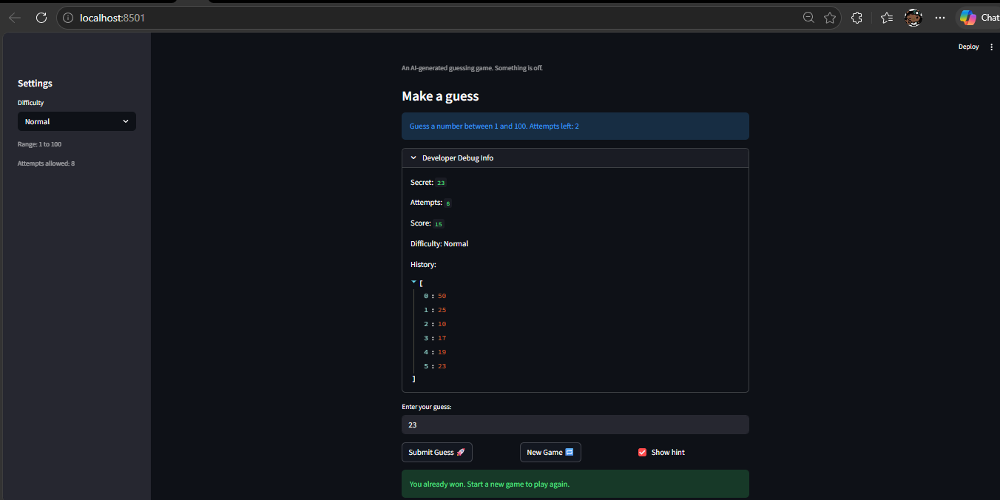

# 🎮 Game Glitch Investigator: The Impossible Guesser

## 🚨 The Situation

You asked an AI to build a simple "Number Guessing Game" using Streamlit.
It wrote the code, ran away, and now the game is unplayable.

* You can't win.
* The hints lie to you.
* The secret number seems to have commitment issues.

## 🛠️ Setup

1. Install dependencies: `pip install -r requirements.txt`
2. Run the fixed app: `python -m streamlit run app.py`
3. Run tests: `pytest`

## 🕵️‍♂️ What Was Broken

The AI-generated code had four bugs:

1. **Inverted hints** – "Too High" told you to go higher, and "Too Low" told you to go lower. The messages were completely backwards.
2. **String/int type mixing** – On even-numbered attempts, the secret number was secretly converted to a string, breaking numeric comparisons and making it impossible to win on those turns.
3. **Hard mode was too easy** – The Hard difficulty range (1–50) was smaller than Normal (1–100), making Hard the easiest mode.
4. **Score rewarded wrong guesses** – The scoring function gave +5 points for "Too High" answers on even attempts, allowing the player to farm points by guessing wrong.

## 🔧 Fixes Applied

- Moved all game logic (`check_guess`, `parse_guess`, `get_range_for_difficulty`, `update_score`) into `logic_utils.py`
- Fixed inverted hint messages in `check_guess`
- Removed string conversion of secret number in `app.py`
- Fixed Hard difficulty to return a range of 1–200
- Fixed `update_score` to always deduct points for wrong guesses
- Fixed hardcoded "1 to 100" UI label to display the actual difficulty range
- Fixed attempts counter to start at 0

## 📝 Document Your Experience

**Game purpose:** A number guessing game where the player tries to identify a randomly chosen secret number within a limited number of attempts. Hints guide the player higher or lower after each guess.

**Bugs found:** See the list above and `reflection.md` for full details.

**Fixes applied:** Core logic was refactored from `app.py` into `logic_utils.py`. The four bugs above were corrected with comments in the code marking each fix.

## 📸 Demo

## 🚀 Stretch Features

*[If you completed a challenge extension, describe it here]*
